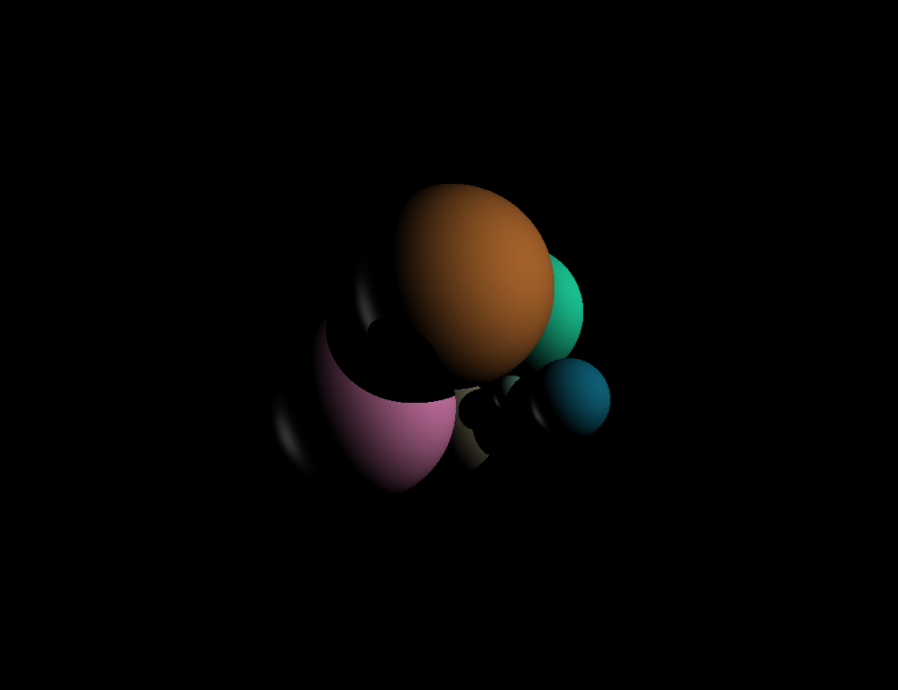
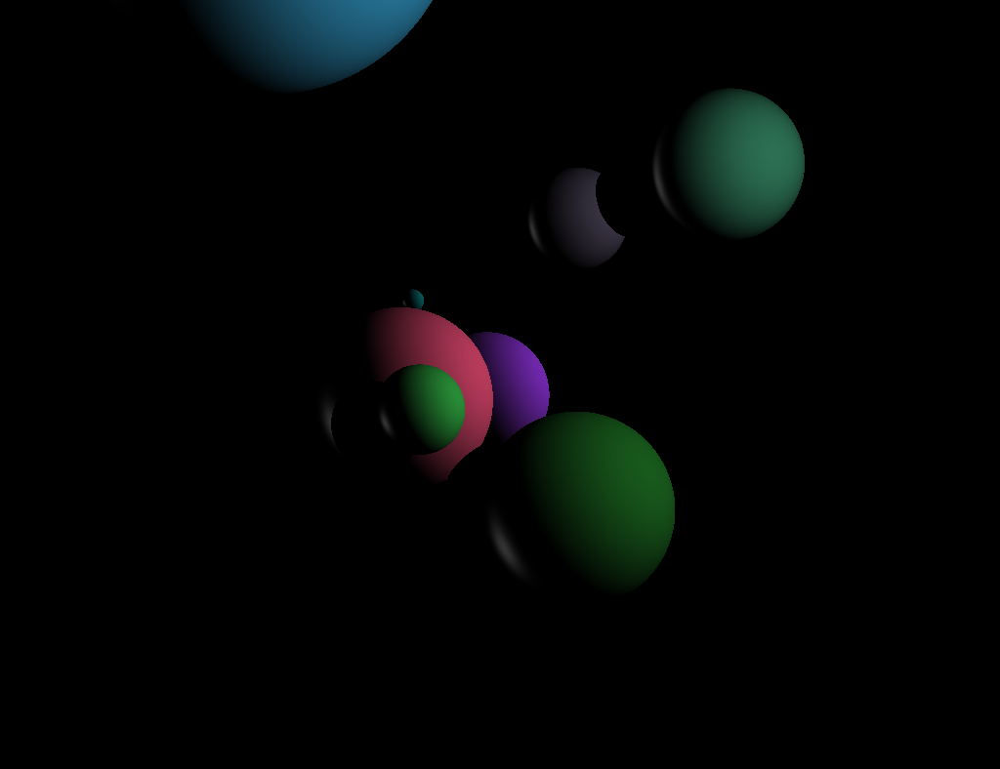
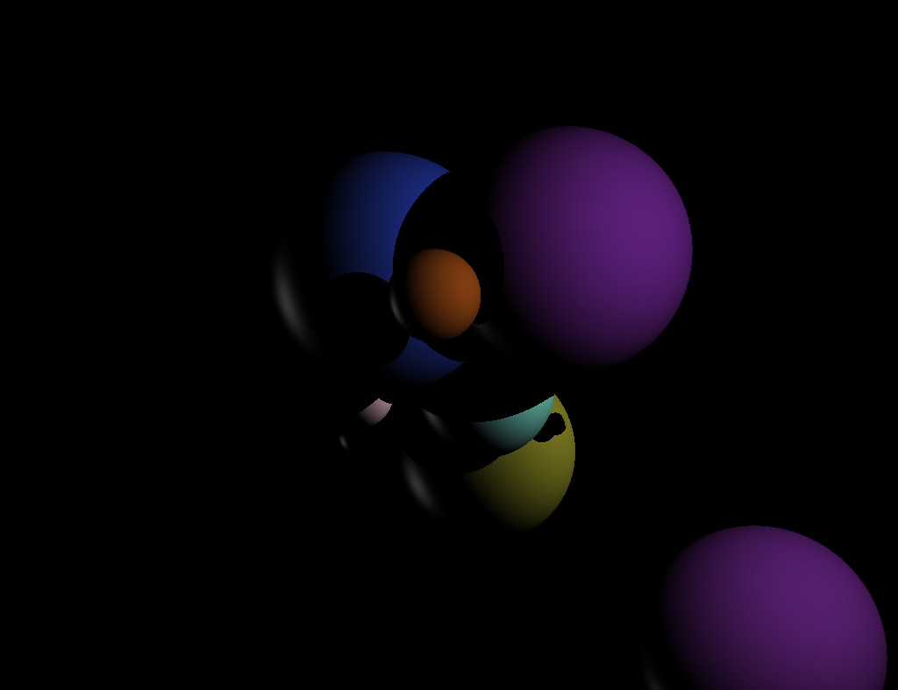

# Raytracer project

Simple raytracer that randomly generates spheres and render them with diffuse Phong shading.

## Build

```console
Ninas-MacBook-Pro:~ mkdir build && cd build
Ninas-MacBook-Pro:~ make
Ninas-MacBook-Pro:~ ./main
Ninas-MacBook-Pro:~ open scene.ppm
```

## Sample of generated scenes






